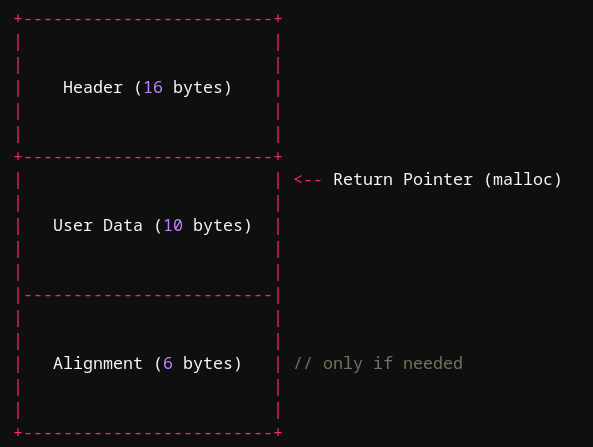
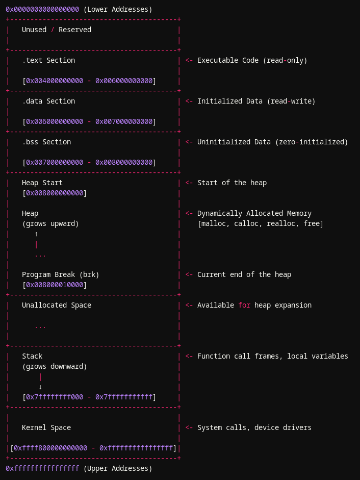
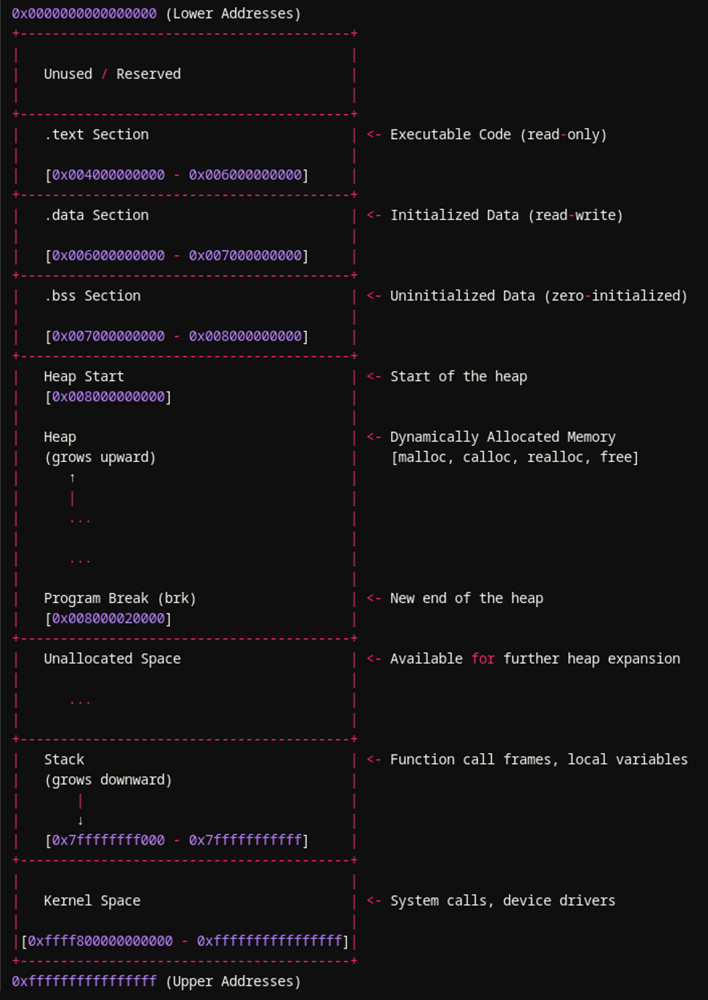

16-08-2024

---

### **Table of Contents**

1. [Intro](#intro)
2. [Basics Memory Allocation](#basics-memory-allocation)
3. [Chunk Allocation](#chunk-allocation)
    1. [Allocation From Free List (bins)](#allocation-from-free-list-bins)
    2. [Allocation From Top Chunk](#allocation-from-top-chunk)
    3. [Requesting Kernel For Extra Heap Memory](#requesting-kernel-for-extra-heap-memory)
    4. [Using mmap for Larger Allocation](#using-mmap-for-larger-allocation)
4. [Freeing Allocated Chunk](#freeing-allocated-chunk)
    1. [Freeing a Chunk](#freeing-a-chunk)
    2. [Adding to Free Lists/Bins](#adding-to-free-listsbins)
    3. [Managing Free Lists](#managing-free-lists)


---

### **Intro**

Welcome back to the second part of the Heap Exploitation Series. In the previous [**Part**](https://stackxbyte.github.io/posts/heap_exploitation/heap_exploitation_journey_part1.html), I provided a basic overview of glibc’s heap implementation. If you haven't read that part yet, I highly recommend you go back and check it out to understand fundamental concepts such as chunks and bins. However, if you are already familiar with these basics, you can continue reading here. In this post, we will delve deeper into the process of memory allocation and deallocation in glibc’s heap. We’ll explore how memory is allocated for a process and the mechanisms involved in freeing memory.

---

### **Basics Memory Allocation**

When you request memory for your program, for example, 0x10 bytes of memory, by calling `malloc`, it returns a pointer to the allocated memory space where you can store your data. However, the allocation process involves more than simply providing 16 bytes of free memory space.

The heap manager performs several additional tasks behind the scenes. It keeps track of all allocated memory chunks by storing metadata alongside the user-requested space. This metadata includes information such as the size of the allocated chunk and its status (e.g., whether it is free or in use). Additionally, the heap manager ensures proper memory alignment for better efficiency. On 32-bit systems, memory is typically aligned to 0x8 (8) bytes, while on 64-bit systems, it is aligned to 0x10 (16) bytes.

> When you request 0x10 (16) bytes of memory, the heap manager actually allocates more than just 16 bytes. In practice, it typically allocates a total of 32 bytes. This allocation includes 16 bytes for metadata or a header, which contains information about the allocated chunk, such as its size and status. Additionally, it includes the 16 bytes you requested for storing your data. To ensure proper alignment, particularly on 64-bit systems where memory is aligned to 16-byte blocks, 6 bytes of padding are added. This padding ensures that the memory allocation is aligned correctly, making the total allocated memory 32 bytes, accommodating both the user-requested space and the necessary overhead for metadata and alignment.
> 

```
Requested Size: 10 bytes
Total Without Alignment: 10 + 16 = 26 bytes
Alignment Padding: To align to 16 bytes, we need 6 more bytes to reach 32 bytes
Total Allocated Size: 32 bytes
Overhead: 32 - 10 = 22 bytes
```

> **Allocated Chunk Example**
> 



After that heap manager mark this chunk as allocated and returns a pointer to the “User Data” region inside the chunk. which is the same return pointer you get from the malloc after the memory allocation.

---

### **Chunk Allocation**

***Before Talking about how a Chunk is allocated lets talk about how a heap is created in the first place*** 

When `malloc` is called for the first time, the heap manager initiates the creation of the heap segment for the program. Initially, the operating system does not allocate any memory for the heap, but when the first memory allocation request is made, the heap manager uses system calls such as `brk` or `sbrk` to adjust the program break, effectively expanding the heap segment by allocating additional memory from the operating system. If the request is for a large amount of memory, the heap manager may use `mmap` to map a new memory region directly. The heap manager then initializes its internal data structures, such as free lists or bins, to manage the newly allocated heap space. This setup allows the heap to handle subsequent memory allocation and deallocation requests efficiently. 

***Now lets see how the heap manager allocates the chunks.***

There are various way a memory chunk can be allocated.

1. **Allocation From Free List (bins)**
2. **Allocation From Top Chunk** 
3. **Requesting Kernel For Extra Heap Memory** 
4. **Using mmap for Larger Allocation**

### **Allocation From Free Lists (Bins)**

The heap manager has multiple free lists, also known as bins. These bins store all the chunks that are freed. The freed chunks are stored in different lists based on their size. For example, chunks larger than 512 bytes are stored in the large bin.

When you request memory from the heap manager, it will search through the bins and try to find a free chunk that can fit the requested size. If the heap manager finds a chunk that is big enough to fulfill your allocation request, it will mark that chunk as allocated and return a pointer to the "User Data" area to the program. After that chunk is no longer in use and gets freed, the heap manager will add that chunk back to the free list (bin).


### **Allocation From Top Chunk**

The top chunk is a unique feature of the GLIBC memory allocator. It represents the last free chunk in the heap and is notable for being the largest among all the chunks. This chunk can be dynamically expanded as needed. There is only one top chunk in the entire heap. If the heap manager fails to find a suitable free chunk that matches desired allocation request, then it will create a new chunk from the top chunk and resize the top chunk accordingly and allocate that newly create chunk to the program.


### **Requesting Kernel For Extra Heap Memory**

When the heap memory is fully exhausted or there is insufficient memory available at the top chunk to allocate a large-sized chunk, the heap manager requests the kernel to add more memory to the heap, expanding its size. The heap manager expands heap memory using the `sbrk` system call by adjusting the program break, which defines the end of the heap. When a program requests more memory than is available within the current heap, the heap manager invokes `sbrk` to increase the size of the heap. This is done by moving the program break to a higher address, effectively extending the heap's boundaries. The newly allocated memory is then used to expand the top chunk, the largest free chunk in the heap. The `sbrk` call increases the size of the top chunk, allowing it to accommodate new allocations. As a result, the heap grows upward, providing additional space for dynamic memory allocation, and the program can continue to request and manage memory efficiently.

**Heap Layout Before sbrk Syscall**



**Heap Layout After sbrk Syscall** 



### **Using mmap for Larger Allocation**

Larger memory chunks are allocated using `mmap`. When a program requests a chunk of memory that exceeds the usual size limits of the heap, the heap manager uses `mmap` to allocate this memory outside the heap's standard area. In the chunk metadata, which contains information about the memory block such as size and status, the `M` bit is set to indicate that this allocation was performed using `mmap`. Metadata for chunks managed by `mmap` includes flags that denote the allocation method and manage the block’s lifecycle. When this memory is no longer needed and is freed by the `free()` function, the heap manager uses `munmap` to return the entire mapped region of memory back to the system, ensuring that the resources are released appropriately. This separation of memory management methods helps optimize performance and manage large memory requests efficiently.

---

### **Freeing Allocated Chunk**

### **1. Freeing a Chunk**

In glibc’s ptmalloc, when a chunk of memory is freed, the allocator updates the chunk's metadata to reflect its new status as free. This involves setting the `prev_size` field (which holds the size of the previous chunk) and adjusting the `size` field to indicate that the chunk is no longer allocated. The `in_use` flag is cleared to mark the chunk as available. Optionally, the allocator may zero out the chunk's data to prevent residual data from being exposed, although this is not always performed due to performance trade-offs. Once the chunk’s metadata is updated, it is prepared for insertion into the appropriate free list or bin, based on its size and the allocator’s configuration.


### **2. Adding to Free Lists/Bins**

After the chunk is marked as free, it is added to the appropriate free list or bin depending on its size and the state of the thread cache. If tcache is enabled and the chunk's size matches one of the tcache size classes, the chunk is placed into the corresponding thread-specific tcache bin. This bin is part of a per-thread cache designed to reduce allocation and deallocation latency by avoiding contention with other threads. If the chunk does not fit into any tcache bin—either because it is too large or tcache is not utilized—it is added to the global free list. The global free list is organized by size classes and is used to manage free chunks that can be shared among all threads, improving scalability.


### **3. Managing Free Lists**

Effective management of free lists involves several critical operations to optimize memory usage and reduce fragmentation. When a chunk is inserted into a free list or bin, the allocator updates its metadata to integrate the chunk into the appropriate list for its size class. The chunk is linked to other free chunks using pointers maintained in the free list’s data structure. Additionally, if the freed chunk is adjacent to other free chunks in memory, ptmalloc performs coalescing, which merges these adjacent chunks into a single larger block. This reduces fragmentation and increases the size of contiguous free memory. The allocator continuously updates its internal data structures to reflect the changes, ensuring accurate tracking of available memory and maintaining efficient allocation strategies.


---

Reference

---

[https://sploitfun.wordpress.com/2015/02/10/understanding-glibc-malloc/](https://sploitfun.wordpress.com/2015/02/10/understanding-glibc-malloc/)

[https://azeria-labs.com/heap-exploitation-part-2-glibc-heap-free-bins/](https://azeria-labs.com/heap-exploitation-part-2-glibc-heap-free-bins/)

[https://azeria-labs.com/heap-exploitation-part-1-understanding-the-glibc-heap-implementation/](https://azeria-labs.com/heap-exploitation-part-1-understanding-the-glibc-heap-implementation/)

[https://codebrowser.dev/glibc/glibc/malloc/malloc.c.html](https://codebrowser.dev/glibc/glibc/malloc/malloc.c.html)
